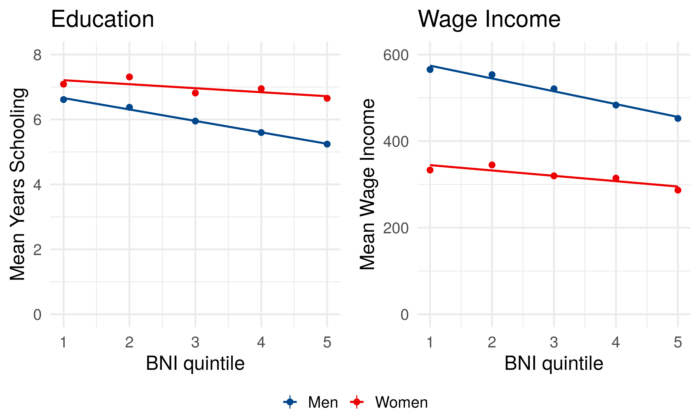
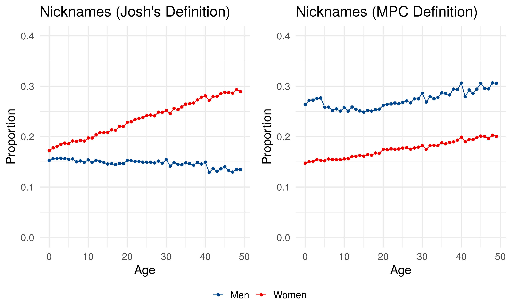

## Summary

Despite a large literature on race-specific first names negatively impacting life chances, the relationship between longevity and having a black name remains largely unexplored.

This notebook looks at the whether having a distinctively black first names in 1940—as measured by a black names index (BNI)—is associated with relative lower social attainment for blacks in 1940. 

I'm working on the UC Berkeley Demography FC server. 

## Prepare data

Steps to prepare data: 

(1) Read in the full count 1940 census data

(2) Restrict to Blacks 

(3) Clean names in the 1940 census (Josh's code)

(4) Merge on info on BNI (Black Name Index) on first name


```{r prep, eval = F}
## library packages
library(data.table)
library(tidyverse)
library(ggpubr)
library(lfe)


## read in census and restricts to black folks 
census <- fread("/home/ipums/casey-ipums/IPUMS2019/1940/TSV/P.tsv")


## Filter to only include those who identify as black
census_blacks <- census %>% 
  filter(RACE == 200)

## remove census
rm(census)

## read in BNI 
bni <- fread("../../data/bni.csv")

## First names cleaning
## various NA strings
na.strings = c("^$", # empty string
               "^NA$",
               ## varieties of "UNKNOWN"
               "^UKN", # start with UKN ...
               "^UNK", # start with UNK ...
               "^UN$", "^U$", "^NS$",
                "^UK$",
               ## varieties of NOT and NONE
               "NONENAMED",
               "^NONE$",
               "^NOT",
               "NONAME",
               ## variaeties of X, XX, XXXXXX
               "^X*$",
               ## other
               "UNSTATED",
               "UNLISTED",
               "^UNAV", ## unavailable and misspellings thereof
               "MISSING",
               "^UNDISCLO",
               "^UNSPEC",
               "WITHHELD",
               "DECEASED",
               "^NAME$")

na.regx = paste(na.strings, collapse = "|") ## regexp for 'or'

clean_first_names <- function(fname)
{
    ## Missing --> NA
    fname[grepl(pattern = na.regx, fname)] <- NA
    ## first word only
    fname <- gsub(pattern = " .*$", replacement = "", x = fname)
    ## NA if 0 or 1 characters
    fname[nchar(fname) < 2] <- NA
    fname
}

setDT(census_blacks)

census_blacks[, nick := (fname != "LESLIE" & (
    grepl("IE$", fname) |
    fname %in% c("MOSE", "DAN", "JOHNNY", "ABE", "JAKE", "JIM", "JIMMY",
                 "TOM", "ED", "EDD", "CHARLEY", "JEFF", "BEN")
                                   )
)]

  
## clean names
census_blacks <- census_blacks %>% 
  mutate(fname = clean_first_names(NAMEFRST))

## add BNI
census_blacks <- census_blacks %>% 
  left_join(bni, by = "fname")

## recode educ_yrs var to years of education
census_blacks <- census_blacks %>%
  mutate(educ_yrs = case_when(
  EDUC == 2 ~ 0,
  EDUC == 14 ~ 1,
  EDUC == 15 ~ 2,
  EDUC == 16 ~ 3,
  EDUC == 17 ~ 4,
  EDUC == 22 ~ 5,
  EDUC == 23 ~ 6,
  EDUC == 25 ~ 7,
  EDUC == 26 ~ 8,
  EDUC == 30 ~ 9,
  EDUC == 40 ~ 10,
  EDUC == 50 ~ 11,
  EDUC == 60 ~ 12,
  EDUC == 70 ~ 13,
  EDUC == 80 ~ 14,
  EDUC == 90 ~ 15,
  EDUC == 100 ~ 16,
  EDUC == 110 ~ 17
)) %>% 
  mutate(sex = case_when(
    SEX == 1 ~ "Men",
    SEX == 2 ~ "Women"
  )) 


census_blacks <- census_blacks %>% 
  filter(BPL < 15000)

census_houshold <- fread("/home/ipums/casey-ipums/IPUMS2019/1940/TSV/H.tsv")

census_blacks <- census_blacks %>% 
  inner_join(census_houshold, by = c("SERIALP" = "SERIAL"))


## add on MPC nicknames 
mpc_nicknames <- fread("/censoc/data/crosswalks/mpc_nickname_file.csv") %>% 
  filter(stdizd == 1) %>% 
  select(fname = NAME1_CLEAN) %>% 
  mutate(nick_mpc = 1)

census_blacks <- census_blacks %>% 
  left_join(mpc_nicknames, by = "fname") 

census_blacks <- census_blacks %>% 
  mutate(nick_mpc = replace_na(nick_mpc, 0))

fwrite(census_blacks, "/censoc/data/working_files/census_blacks.csv")

```
### Black Name Index 

The black name index (BNI) is a summary measure of how distinctively black a first names are: 

\begin{equation}
BNI_{name} = \frac{\mathbb{P}(name|Black)}{\mathbb{P}(name|Black) + \mathbb{P}(name|White)} \cdot 100
\end{equation}

## Disadvantage in 1940

Are Blacks with high BNI already disadvantaged in 1940, with respect to income, occupation, and educational attainment?

Let's look at pooled cohorts of 1905-1915 (~Ages 25-35 in census).

```{r, eval = F}
bni_incwage <- census_blacks %>% 
  filter(INCWAGE > 0 & INCWAGE < 5005) %>% 
  filter(AGE %in% c(25:35)) %>% 
 #  filter(SEX == 1) %>% 
  mutate(bni_decile = ntile(bni, 5)) %>% 
  group_by(bni_decile, sex) %>% 
  summarize(mean_incwage = mean(INCWAGE, na.rm = T), n = n(),
            se = sd(INCWAGE) / sqrt(n()))

income <- ggplot(data = bni_incwage, aes(x = bni_decile,
                               y = mean_incwage,
                               ymin = mean_incwage - 2*se,
                               ymax = mean_incwage + 2*se, color = sex)) + 
  geom_pointrange() +
  theme_minimal(base_size = 20) + 
  ylim(0, 600) + 
  scale_x_continuous(breaks=seq(0,5,1)) +
  labs(x = "BNI quintile",
      y = "Mean Wage Income",
      title = "Wage Income") +
  geom_smooth(method = "lm", se = F) +
  ggsci::scale_colour_lancet() + 
  theme(legend.title=element_blank(), legend.position = "bottom")

bni_education <- census_blacks %>% 
  mutate(bni_decile = ntile(bni, 5)) %>% 
  filter(AGE %in% c(25:35)) %>% 
  group_by(bni_decile, sex) %>% 
  summarize(mean_educ_yrs = mean(educ_yrs, na.rm = T),
            se = sd(educ_yrs, na.rm = T)/sqrt(n()))

education <- ggplot(data = bni_education, aes(x = bni_decile,
                                 y = mean_educ_yrs,
                                 ymin = mean_educ_yrs - 2*se,
                                 ymax = mean_educ_yrs + 2*se,
                                 color = sex)) + 
  geom_pointrange() +
  theme_minimal(base_size = 20) + 
  ylim(0, 8) +
  scale_x_continuous(breaks=seq(0, 5, 1)) +
  labs(title = "Education",
       x = "BNI quintile",
       y = "Mean Years Schooling") + 
  geom_smooth(method = "lm", se = F) +
  ggsci::scale_colour_lancet() + 
  theme(legend.title=element_blank(), legend.position = "bottom")

bni_1940_covariates <- ggarrange(education, income, common.legend = T, legend = "bottom")

ggsave(plot = bni_1940_covariates, filename = "figures/bni_1940_covariates.png", width = 10, height = 6)
```




Yes, high BNI is associated with a lower social status in 1940. 

## Nicknames

Is there any way to tell if people with names like “JESSIE” and “TOM” were given those names as children, or did they adopt these “nicknames” (vs. JESSE and THOMAS) later in life? If they did, then what we could be observing is reverse causality, whereby names are caused _by_ SES and not the other way around.

The figure below show the extent to which the nicknames are increasing with age in the 1940 census among blacks. The plot shows nickname share for age 0-50. 

```{r, eval = F}
nick_name <- census_blacks %>% 
  filter(AGE < 50 ) %>% 
  group_by(AGE, sex) %>% 
  summarize(nick_frac = mean(nick), nick_frac_mpc = mean(nick_mpc))

nicknames <- ggplot(nick_name, aes(x = AGE, y = nick_frac, color = as.factor(sex))) + 
  geom_point() + 
  geom_line() +
  theme_minimal(base_size = 17) +
  ylim(0, .4) + 
  labs(title = "Nicknames (Josh's Definition)",
       x = "Age",
       y = "Proportion") +
  ggsci::scale_colour_lancet() + 
  theme(legend.title=element_blank(), legend.position = "bottom")

nicknames_mpc <- ggplot(nick_name, aes(x = AGE, y = nick_frac_mpc, color = as.factor(sex))) + 
  geom_point() + 
  geom_line() +
  theme_minimal(base_size = 17) +
  ylim(0, .4) + 
  labs(title = "Nicknames (MPC Definition)",
       x = "Age",
       y = "Proportion") +
  ggsci::scale_colour_lancet() + 
  theme(legend.title=element_blank(), legend.position = "bottom")

nicknames_combined <- ggarrange(nicknames, nicknames_mpc, common.legend = T, legend = "bottom")

ggsave(plot = nicknames_combined, filename = "figures/nickname_propotion.png", width = 10, height = 6)
```




## Sibling Fixed Effects


```{r, eval = F}
## read in blacks in the census
census_blacks <- fread("/censoc/data/working_files/census_blacks.csv")

## restrict to those 12-16
census_blacks_sibs <- census_blacks %>% 
  filter(AGE %in% 12:16) %>% 
  filter(SEX == 1)

## restrict to siblings (2-5) with names appearing 500+ times
sibs <- census_blacks_sibs %>% 
  drop_na(educ_yrs, bni) %>% 
  filter(name_freq > 500) %>% 
  group_by(SERIALP, NAMELAST) %>% 
  mutate(n = n()) %>% 
  ungroup() %>% 
  filter(n %in% 2:5)

## run fixed effect models
bni <- felm(educ_yrs ~ bni | as.factor(AGE),
     data = sibs)

bni.sibfe <- felm(educ_yrs ~ bni | as.factor(SERIALP) + as.factor(AGE),
     data = sibs)

## display fixed effect models
stargazer::stargazer(bni,
                     bni.sibfe, 
                     object.names = TRUE,
                     type = "html")

# ===========================================================
#                               Dependent variable:          
#                     ---------------------------------------
#                                    educ_yrs                
#                             (1)                 (2)        
#                             bni              bni.sibfe     
# -----------------------------------------------------------
# bni                      -1.820***            0.043**      
#                           (0.021)             (0.019)      
#                                                            
# -----------------------------------------------------------
# Observations              206,575             206,575      
# R2                         0.140               0.918       
# Adjusted R2                0.140               0.848       
# Residual Std. Error 2.212 (df = 206569) 0.929 (df = 112051)
# ===========================================================
# Note:                           *p<0.1; **p<0.05; ***p<0.01
```

What is the relationship between BNI and education for black male siblings ages 12-16? 

Here we will fit two models: 

(1) BNI and fixed age effects (same as cohort birth-year fixed effects)

(2) BNI with age and sibling fixed effects

The magnitude of the effect of BNI on education is trivial once we include sibling fixed effects. 

<table style="text-align:center"><tr><td colspan="3" style="border-bottom: 1px solid black"></td></tr><tr><td style="text-align:left"></td><td colspan="2"><em>Dependent variable:</em></td></tr>
<tr><td></td><td colspan="2" style="border-bottom: 1px solid black"></td></tr>
<tr><td style="text-align:left"></td><td colspan="2">educ_yrs</td></tr>
<tr><td style="text-align:left"></td><td>(1)</td><td>(2)</td></tr>
<tr><td style="text-align:left"></td><td>bni</td><td>bni.sibfe</td></tr>
<tr><td colspan="3" style="border-bottom: 1px solid black"></td></tr><tr><td style="text-align:left">bni</td><td>-1.820<sup>***</sup></td><td>0.043<sup>**</sup></td></tr>
<tr><td style="text-align:left"></td><td>(0.021)</td><td>(0.019)</td></tr>
<tr><td style="text-align:left"></td><td></td><td></td></tr>
<tr><td colspan="3" style="border-bottom: 1px solid black"></td></tr><tr><td style="text-align:left">Observations</td><td>206,575</td><td>206,575</td></tr>
<tr><td style="text-align:left">R<sup>2</sup></td><td>0.140</td><td>0.918</td></tr>
<tr><td style="text-align:left">Adjusted R<sup>2</sup></td><td>0.140</td><td>0.848</td></tr>
<tr><td style="text-align:left">Residual Std. Error</td><td>2.212 (df = 206569)</td><td>0.929 (df = 112051)</td></tr>
<tr><td colspan="3" style="border-bottom: 1px solid black"></td></tr><tr><td style="text-align:left"><em>Note:</em></td><td colspan="2" style="text-align:right"><sup>*</sup>p<0.1; <sup>**</sup>p<0.05; <sup>***</sup>p<0.01</td></tr>
</table>

## TODO 

If one controls for these aspects (education, income) of names in 1940, does this explain the longevity gradient?

